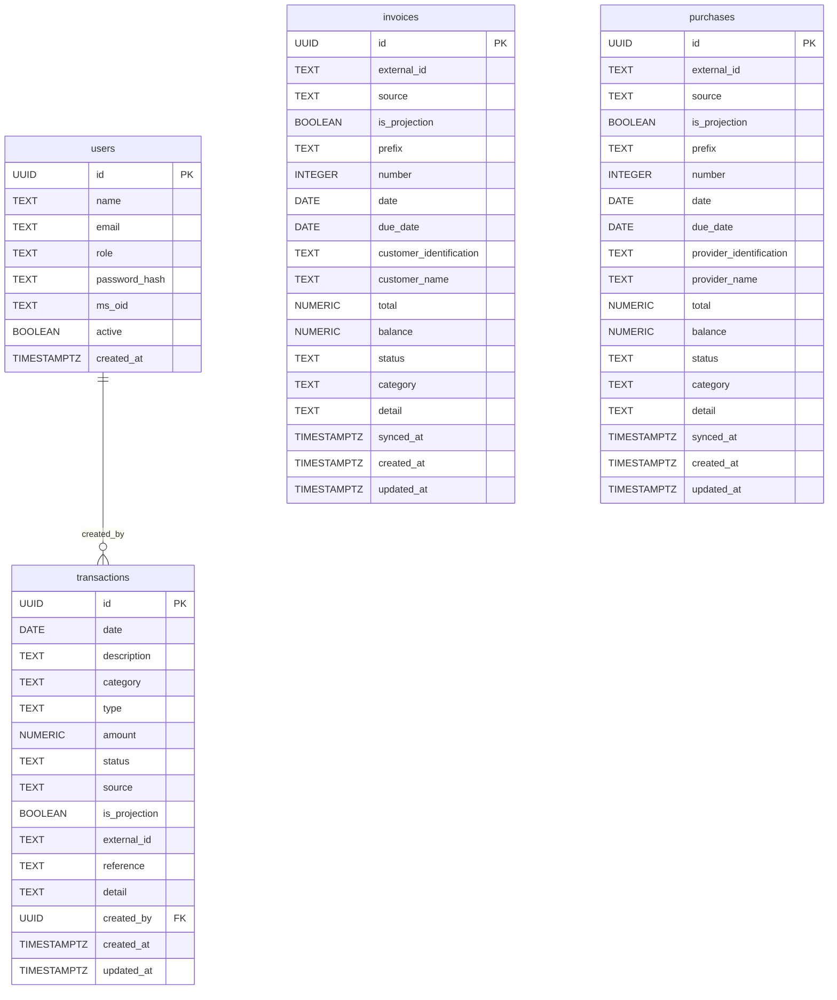
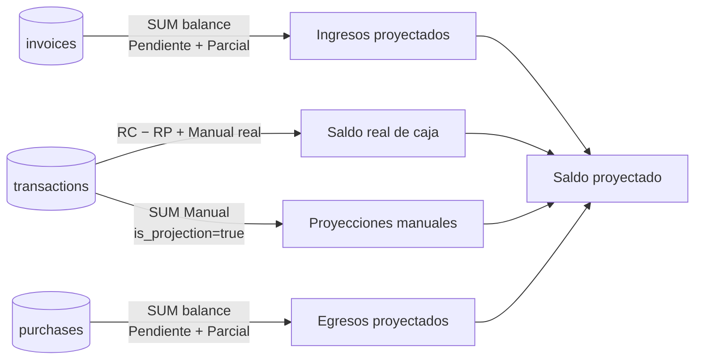

# Schema & Data Flow

## Modelo de datos

---

## Flujo de datos

---

## Cálculo de saldos

---

## Fuentes y roles

| Fuente | Tabla | `source` | `is_projection` | Rol |
|---|---|---|---|---|
| Siigo `/v1/invoices` | `invoices` | `Siigo` | `false` | Cartera por cobrar |
| Siigo `/v1/purchases` | `purchases` | `Siigo` | `false` | Cuentas por pagar |
| Siigo `/v1/vouchers` | `transactions` | `Siigo` | `false` | Cobro real de cliente |
| Siigo `/v1/payment-receipts` | `transactions` | `Siigo` | `false` | Pago real a proveedor |
| Usuario manual | `transactions` | `Manual` | `false` | Movimiento real sin factura |
| Usuario manual | `transactions` | `Manual` | `true` | Proyección hipotética |

---

## Estados por tabla

**`invoices` y `purchases`** — reflejan el estado de pago en Siigo. `source = 'Siigo'` bloquea edición y eliminación por el usuario. `is_projection` es siempre `false` — son obligaciones reales, no hipótesis:

| `status` | `balance` | Significado |
|---|---|---|
| `Pendiente` | `= total` | Sin pagos recibidos |
| `Parcial` | `> 0 y < total` | Pagos parciales recibidos |
| `Completado` | `= 0` | Totalmente pagado |
| `Anulado` | — | Documento anulado en Siigo |

**`transactions`** — estado del movimiento de caja. `source = 'Siigo'` bloquea edición y eliminación por el usuario. RC y RP se distinguen por `type` (Ingreso / Egreso). `is_projection` es siempre `false` para registros de Siigo — son movimientos reales de caja:

| `source` | `type` | `is_projection` | `status` | Significado |
|---|---|---|---|---|
| `Siigo` | `Ingreso` | `false` | `Completado` | Cobro real recibido (RC) |
| `Siigo` | `Egreso` | `false` | `Completado` | Pago real ejecutado (RP) |
| `Manual` | `Ingreso` / `Egreso` | `false` | `Completado` | Movimiento real ingresado por usuario |
| `Manual` | `Ingreso` / `Egreso` | `true` | `Pendiente` | Proyección hipotética futura |
| `Siigo` / `Manual` | — | — | `Anulado` | Cancelado |
