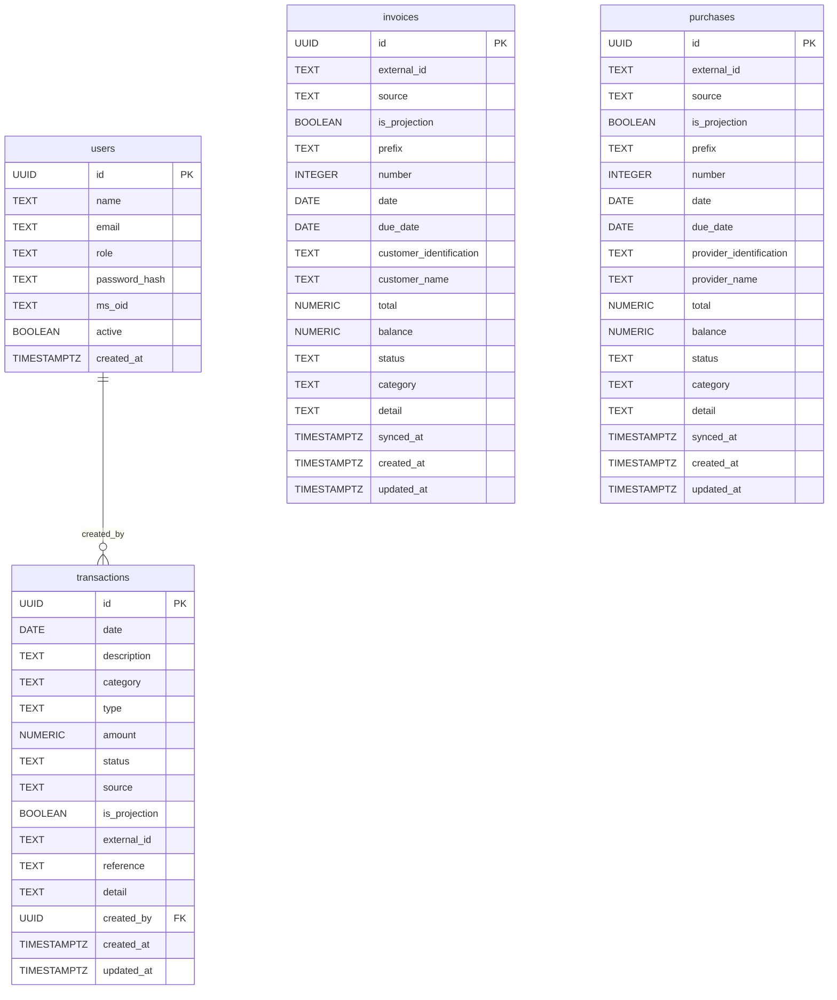
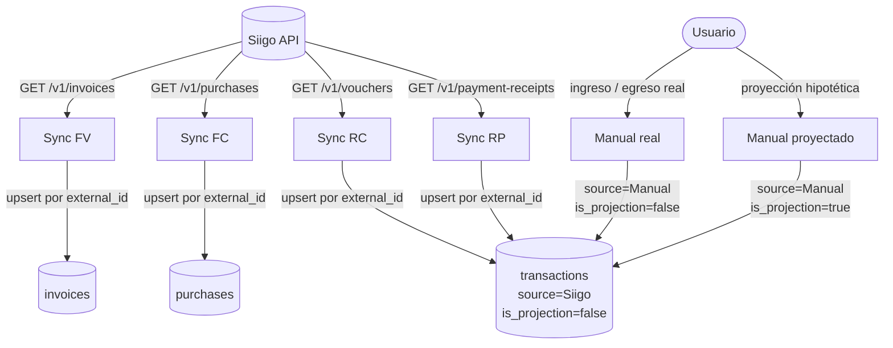
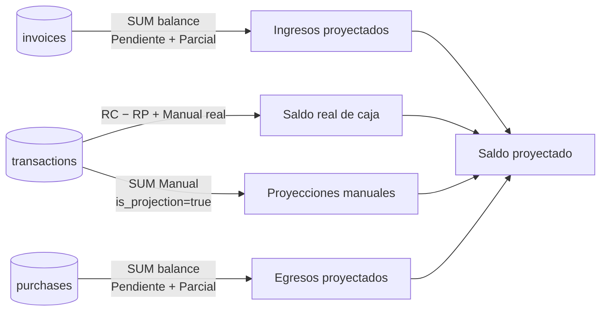

# Schema & Data Flow

## Modelo de datos



---

## Flujo de datos



---

## Cálculo de saldos



---

## Fuentes y roles

| Fuente | Tipo | Tabla | `source` | `is_projection` | Rol |
|---|---|---|---|---|---|
| Siigo `/v1/invoices` | FV | `invoices` | `Siigo` | `false` | Cartera por cobrar |
| Siigo `/v1/purchases` | FC | `purchases` | `Siigo` | `false` | Cuentas por pagar |
| Siigo `/v1/vouchers` | RC | `transactions` | `Siigo` | `false` | Cobro real de cliente |
| Siigo `/v1/payment-receipts` | RP | `transactions` | `Siigo` | `false` | Pago real a proveedor |
| Usuario manual | — | `transactions` | `Manual` | `false` | Movimiento real sin factura |
| Usuario manual | — | `transactions` | `Manual` | `true` | Proyección hipotética |

---

## Transformación por tipo de documento

Todos los documentos se sincronizan en paralelo (hasta 8 goroutines concurrentes). Dentro de cada tipo, las páginas también se descargan en paralelo. El filtro de fecha se aplica localmente — cualquier registro cuya fecha quede fuera de `[dateStart, dateEnd]` se descarta, compensando la imprecisión de la API de Siigo. La operación de escritura es **upsert por `external_id`**: inserta si no existe, actualiza si ya existe.

---

### FV — Factura de Venta (`/v1/invoices` → tabla `invoices`)

Representa una obligación de pago del cliente. No es caja hasta que llega el RC correspondiente.

| Campo destino | Origen Siigo | Notas |
|---|---|---|
| `external_id` | `"siigo-inv-" + inv.ID` | Clave de upsert |
| `reference` | `inv.Name` | Número de factura legible (ej. `FV-0001-000123`) |
| `prefix` | `inv.Prefix` | Prefijo del documento |
| `number` | `inv.Number` | Número correlativo |
| `date` | `inv.Date` | Fecha de emisión |
| `due_date` | `inv.DueDate` o primer `PaymentTerm.DueDate` | Fecha de vencimiento; primer término si el campo principal está vacío |
| `customer_identification` | `inv.Customer.Identification` | NIT / cédula del cliente |
| `customer_name` | `inv.Customer.Name` o `CommercialName` | Nombre comercial preferido |
| `total` | `inv.Total` | Valor total de la factura |
| `balance` | `inv.Balance` | Saldo pendiente de cobro (actualizado por Siigo en cada sync) |
| `status` | `invoiceStatus(balance, total)` | Ver tabla de estados |
| `category` | `categorizeInvoice(itemDescs, customerName)` | Inferencia por palabras clave en ítems y nombre del cliente; default `"Ventas"` |
| `detail` | `inv.Name + " · " + itemDescs` | Descripción compuesta |

---

### FC — Factura de Compra (`/v1/purchases` → tabla `purchases`)

Representa una obligación de pago al proveedor. No es caja hasta que llega el RP correspondiente.

| Campo destino | Origen Siigo | Notas |
|---|---|---|
| `external_id` | `"siigo-pur-" + pur.ID` | Clave de upsert |
| `reference` | `pur.Name` | Número de factura legible (ej. `FC-0001-000456`) |
| `prefix` | `pur.Prefix` | |
| `number` | `pur.Number` | |
| `date` | `pur.Date` | Fecha de emisión |
| `due_date` | `pur.DueDate` o primer `PaymentTerm.DueDate` | |
| `provider_identification` | `pur.Provider.Identification` | NIT del proveedor |
| `provider_name` | `pur.Provider.Name` o `CommercialName` | |
| `total` | `pur.Total` | |
| `balance` | `pur.Balance` | Saldo pendiente de pago |
| `status` | `invoiceStatus(balance, total)` | Misma lógica que FV |
| `category` | `categorizePurchase(itemDescs, providerName)` | Inferencia por palabras clave; default `"Gastos Operativos"` |
| `detail` | `pur.Name + " · " + itemDescs` | |

---

### RC — Recibo de Cobro (`/v1/vouchers` → tabla `transactions`)

Movimiento real de caja: dinero efectivamente recibido del cliente. Siempre `Completado`.

| Campo destino | Origen Siigo | Notas |
|---|---|---|
| `external_id` | `"siigo-rc-" + v.ID` | Clave de upsert |
| `type` | `Ingreso` | Fijo |
| `status` | `Completado` | Fijo — el cobro ya ocurrió |
| `date` | `v.Date` | Fecha del recibo |
| `description` | `v.Name` | Nombre del voucher |
| `reference` | `v.Name` | |
| `amount` | `voucherTotal(v.Total, v.Items, "Debit")` | Suma de ítems con `account.Movement == "Debit"`; fallback al total del voucher si ninguno coincide |
| `category` | `categorizeInvoice(itemDescs, customerName)` | Mismo clasificador que FV |
| `detail` | `v.Name + " · " + itemDescs` | |
| `source` | `Siigo` | Read-only — no editable ni eliminable por el usuario |
| `is_projection` | `false` | |

---

### RP — Recibo de Pago (`/v1/payment-receipts` → tabla `transactions`)

Movimiento real de caja: dinero efectivamente pagado al proveedor. Siempre `Completado`.

| Campo destino | Origen Siigo | Notas |
|---|---|---|
| `external_id` | `"siigo-rp-" + pr.ID` | Clave de upsert |
| `type` | `Egreso` | Fijo |
| `status` | `Completado` | Fijo — el pago ya ocurrió |
| `date` | `pr.Date` | Fecha del recibo |
| `description` | `pr.Name` | |
| `reference` | `pr.Name` | |
| `amount` | `voucherTotal(pr.Total, pr.Items, "Credit")` | Suma de ítems con `account.Movement == "Credit"`; fallback al total si ninguno coincide |
| `category` | `categorizePurchase(itemDescs, providerName)` | Mismo clasificador que FC |
| `detail` | `pr.Name + " · " + itemDescs` | |
| `source` | `Siigo` | Read-only |
| `is_projection` | `false` | |

---

### Lógica `voucherTotal`

RC y RP no usan el campo `total` directamente sino la suma de ítems contables:

```
voucherTotal(total, items, movement):
    sum = Σ item.Value  where item.Account.Movement == movement
    si sum != 0 → devuelve sum
    si sum == 0 → devuelve total   ← fallback al campo raíz
```

- RC usa `movement = "Debit"` — el débito contable representa el ingreso de caja.
- RP usa `movement = "Credit"` — el crédito contable representa la salida de caja.

---

### Inferencia de categoría

Ambos clasificadores concatenan las descripciones de los ítems y el nombre del cliente/proveedor en minúsculas y buscan palabras clave en orden de prioridad:

**`categorizePurchase`** (FC y RP):

| Categoría | Palabras clave (muestra) |
|---|---|
| Personal | nómina, salario, empleado, honorario |
| Tecnología | software, hosting, licencia, cloud, aws |
| Marketing | publicidad, pauta, agencia, branding |
| Arriendo | arriendo, alquiler, oficina, bodega |
| Logística | transporte, flete, mensajería, courier |
| Servicios Públicos | agua, luz, energía, gas, teléfono |
| Legal | abogado, notaría, contrato, escritura |
| Contabilidad e Impuestos | contador, auditoría, impuesto, DIAN |
| Seguros y Beneficios | seguro, póliza, ARL, EPS, pensión |
| Mantenimiento | mantenimiento, reparación, aseo, vigilancia |
| Finanzas | banco, crédito, préstamo, interés, comisión |
| **Gastos Operativos** | *default si ninguna coincide* |

**`categorizeInvoice`** (FV y RC):

| Categoría | Palabras clave (muestra) |
|---|---|
| Consultoría | consultoría, asesor, servicio profesional |
| Tecnología | software, licencia, desarrollo |
| Ventas - Producto | producto, mercancía |
| Mantenimiento | mantenimiento, soporte |
| **Ventas** | *default si ninguna coincide* |

---

### `invoiceStatus` — estado de FV y FC

```
invoiceStatus(balance, total):
    balance <= 0          → Completado   (totalmente cobrado/pagado)
    0 < balance < total   → Parcial      (cobro/pago parcial en curso)
    balance >= total      → Pendiente    (sin ningún cobro/pago aún)
```

---

## Estados por tabla

**`invoices` y `purchases`** — reflejan el estado de pago en Siigo. `source = 'Siigo'` bloquea edición y eliminación por el usuario. `is_projection` es siempre `false` — son obligaciones reales, no hipótesis:

| `status` | `balance` | Significado |
|---|---|---|
| `Pendiente` | `= total` | Sin pagos recibidos |
| `Parcial` | `> 0 y < total` | Pagos parciales recibidos |
| `Completado` | `= 0` | Totalmente pagado |
| `Anulado` | — | Documento anulado en Siigo |

**`transactions`** — estado del movimiento de caja. `source = 'Siigo'` bloquea edición y eliminación por el usuario. RC y RP se distinguen por `type` (Ingreso / Egreso). `is_projection` es siempre `false` para registros de Siigo — son movimientos reales de caja:

| `source` | `type` | `is_projection` | `status` | Significado |
|---|---|---|---|---|
| `Siigo` | `Ingreso` | `false` | `Completado` | Cobro real recibido (RC) |
| `Siigo` | `Egreso` | `false` | `Completado` | Pago real ejecutado (RP) |
| `Manual` | `Ingreso` / `Egreso` | `false` | `Completado` | Movimiento real ingresado por usuario |
| `Manual` | `Ingreso` / `Egreso` | `true` | `Pendiente` | Proyección hipotética futura |
| `Siigo` / `Manual` | — | — | `Anulado` | Cancelado |
